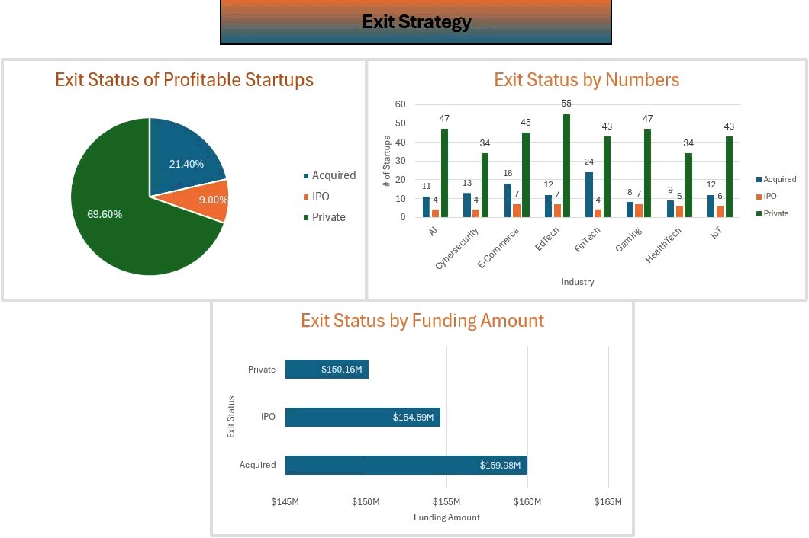

# 📊 Startup Growth & Funding Trends – Excel Dashboard

## 📌 Overview  
This project analyzes startup funding, valuation, growth, and exit patterns using a publicly available dataset.  
The goal is to identify trends that help investors, founders, and analysts understand what drives startup success.

### Key Tools & Skills Used  
- Microsoft Excel (Pivot Tables, Power Query, Power Pivot, VBA)  
- Interactive Dashboards with Dropdowns & Slicers  
- Data Cleaning & Transformation  
- Chart Design & Formatting  

## 📂 Dataset  
**Source:** Startup Growth and Funding Trends – Kaggle  
**Content:** Funding amounts, valuations, industries, regions, revenue, and exit status of startups.

## 📊 Dashboard Sections  
### 1️⃣ Funding Insights  
- Funding by Region  
- Top-Funded Industries  
- Funding Stage Distribution  

### 2️⃣ Growth & Revenue Insights  
- Revenue vs Funding  
- Valuation vs Revenue  
- Profitability Patterns  

### 3️⃣ Regional Breakdown  
- Dynamic Region Selector to compare funding & valuation trends across locations.  

### 4️⃣ Exit Strategy Insights 🧪  
- Exit Status vs Funding  
- Exit Status vs Profitability  
- Exit Status by Industry  

### 5️⃣ Time-based Insights ⏳  
- Startup Age Analysis  
- Funding vs Age  
- Valuation vs Age  
- Revenue Growth Rate Estimates  

## 🖼️ Dashboard Preview  

## ⚙️ How to Use  
- Download the Excel file from this repository.  
- Enable macros to use interactive dropdown chart switching.  
- Use slicers and filters to explore the data dynamically.

## 🚀 Key Learnings  
- How funding varies by industry & region  
- Which industries are more likely to IPO  
- Relationship between startup age and valuation  
- Role of profitability in exit outcomes  

## 📌 Future Improvements  
- Add Power BI version for web-based interactivity  
- Include machine learning predictions for startup success probability  

## 📜 License  
This project is open-source under the MIT License.
